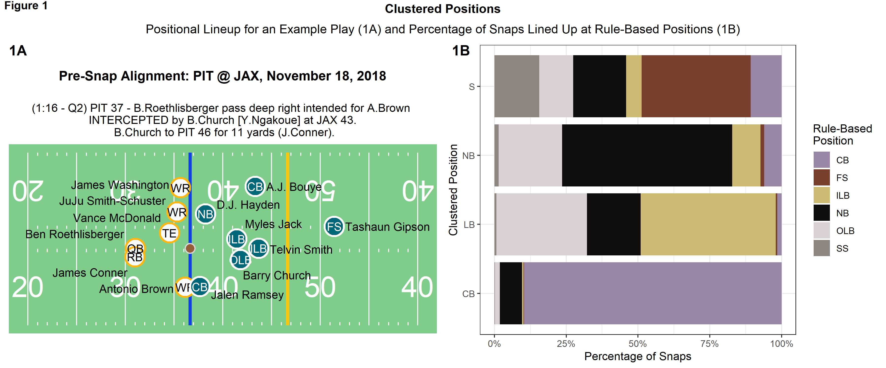
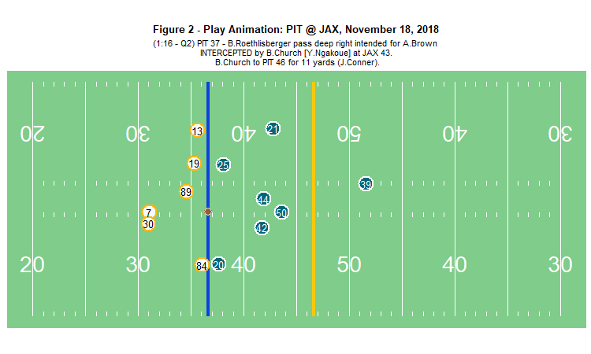
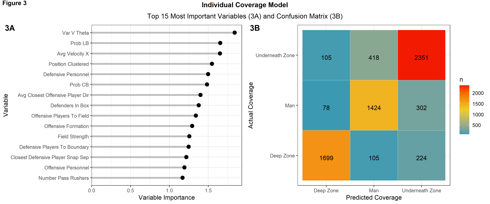
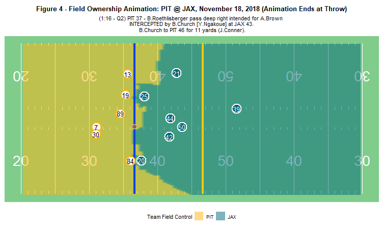
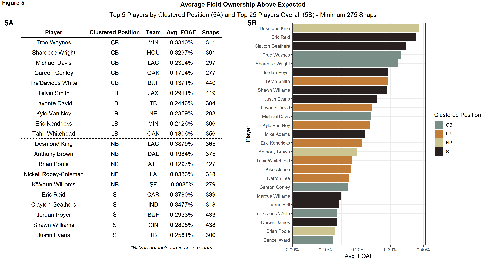
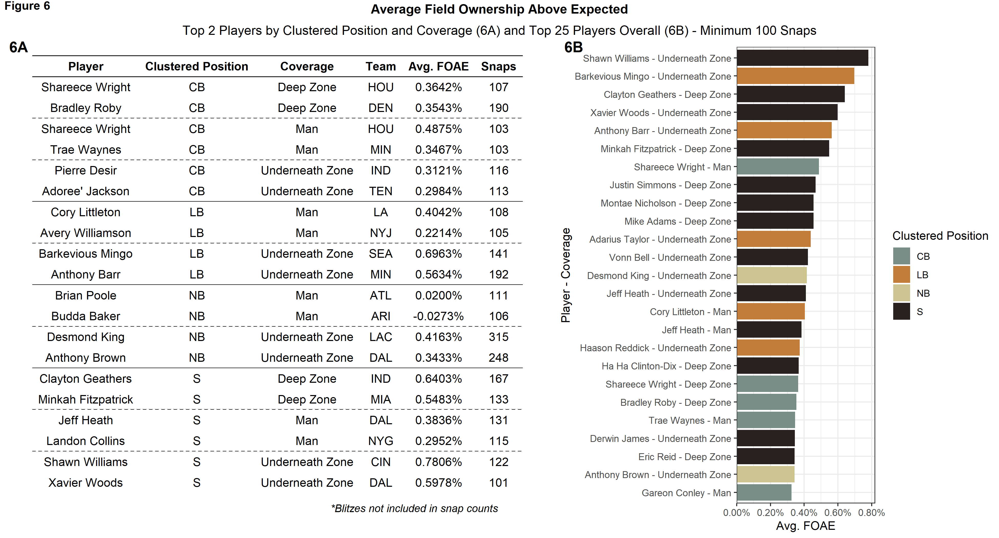
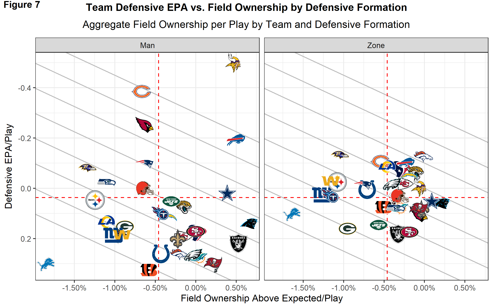

```{r setup, include=FALSE}
knitr::opts_chunk$set(echo = TRUE)
```
Introduction


```{r fig1, echo = FALSE, fig.cap = "Some thoughts about Figure 1", out.width = '100%'}

```


```{r fig2, echo = FALSE, fig.cap = "Some thoughts about Figure 2", out.width = '100%'}

```


```{r fig3, echo = FALSE, fig.cap = "Some thoughts about Figure 3", out.width = '100%'}

```


```{r fig4, echo = FALSE, fig.cap = "Some thoughts about Figure 4", out.width = '100%'}

```


```{r fig5, echo = FALSE, fig.cap = "Some thoughts about Figure 5", out.width = '100%'}

```


```{r fig6, echo = FALSE, fig.cap = "Some thoughts about Figure 6", out.width = '100%'}

```


```{r fig7, echo = FALSE, fig.cap = "Some thoughts about Figure 7", out.width = '100%'}

```

Conclusion:
